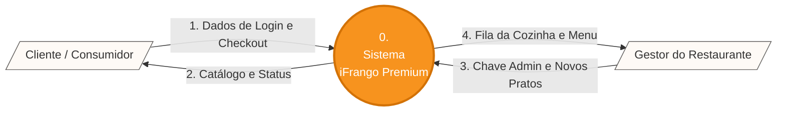
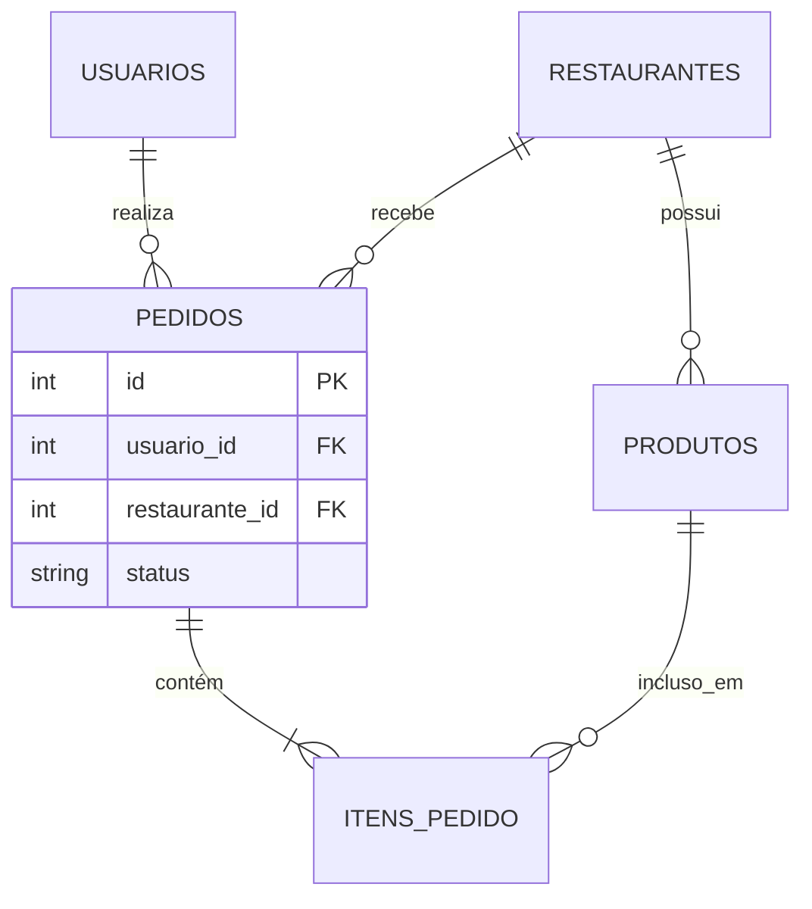

# 🍗 iFrango Premium - Delivery Multi-tenant

**Link da Aplicação em Produção (Protótipo):** [http://ifrango.frangro.com.br](http://ifrango.frangro.com.br)  
**Apresentação do Seminário (Slide Interativo):** Abra o arquivo `Apresentacao_iFrango.html` contido neste repositório no seu navegador.

---

## 👥 Componentes do Grupo
* **Davi Oliveira** - Engenharia de Software / Fullstack

---

## 📄 Documento do Projeto (Padrão ABNT)

### 1. INTRODUÇÃO
O presente documento detalha a engenharia e o desenvolvimento do projeto **iFrango Premium**, um módulo de software voltado para o setor de *food service* e *delivery*. O projeto foi concebido como um Produto Mínimo Viável (MVP) para validar as regras de negócio essenciais de compra, venda e gestão de cardápio em um ambiente *multi-tenant* (múltiplos estabelecimentos na mesma plataforma).

### 2. OBJETIVOS
**2.1 Objetivo Geral:** Desenvolver e homologar um módulo de software web integrado a um banco de dados relacional (PostgreSQL) para gerir o fluxo completo de vendas (checkout) e a administração de cardápios por parte dos fornecedores.

**2.2 Objetivos Específicos:**
* Implementar um sistema de autenticação segregado para Clientes e Gestores.
* Desenvolver um painel administrativo com operações CRUD para a gestão do catálogo.
* Construir um fluxo de carrinho de compras com persistência de dados utilizando chaves estrangeiras (Integridade Referencial).
* Garantir a portabilidade da aplicação através do encapsulamento em contêineres Docker.

### 3. METODOLOGIA E ENGENHARIA DE SOFTWARE
O projeto adotou princípios das metodologias ágeis (Extreme Programming e Scrum). Houve foco no **Desenvolvimento Iterativo** e no **Refactoring Contínuo**, culminando na eliminação de *code-smells* e na transição para uma arquitetura segura e robusta.

### 4. ENGENHARIA DE REQUISITOS

**Requisitos Funcionais (RF):**
* **RF01:** Cadastro e login de Clientes e Gestores.
* **RF02:** Autenticação Multi-tenant protegida por Chave Admin.
* **RF03:** Catálogo segmentado por restaurante.
* **RF04:** Carrinho de Compras dinâmico.
* **RF05:** Persistência de Checkout vinculando IDs de Cliente e Restaurante.
* **RF06:** Adição de pratos e atualização de preços pelo Gestor.
* **RF07:** Atualização de status da Fila da Cozinha.

**Requisitos Não Funcionais (RNF):**
* **RNF01:** API em Python utilizando FastAPI.
* **RNF02:** Persistência relacional em PostgreSQL com ORM (SQLAlchemy).
* **RNF03:** Portabilidade via Docker Compose.
* **RNF04:** Interface SPA com Vanilla JS e Tailwind CSS.

---

## 📊 Arquitetura e Diagramas (UML e DFD)

### Diagrama de Contexto (DFD Nível 0)


### Modelo Entidade-Relacionamento (MER)



---

## 💻 Como Rodar o Protótipo Localmente

Certifique-se de ter o Docker e o Docker Compose instalados.

1. Clone o repositório:

```bash
git clone [https://github.com/imthedavi/iFrango.git](https://github.com/imthedavi/iFrango.git)
cd ifrangrofr

```

2. Suba a infraestrutura:

```bash
docker-compose up --build -d

```

3. Acesse: `http://localhost:8000`

* **Parar servidor:** `docker-compose down`
* **Limpar banco (Hard Reset):** `docker-compose down -v`
