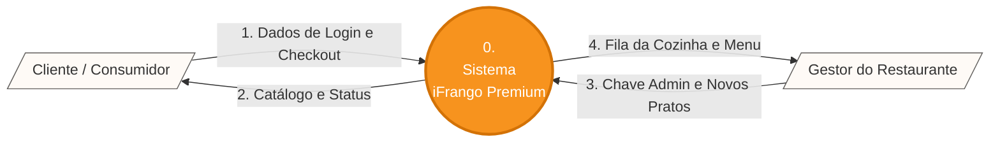
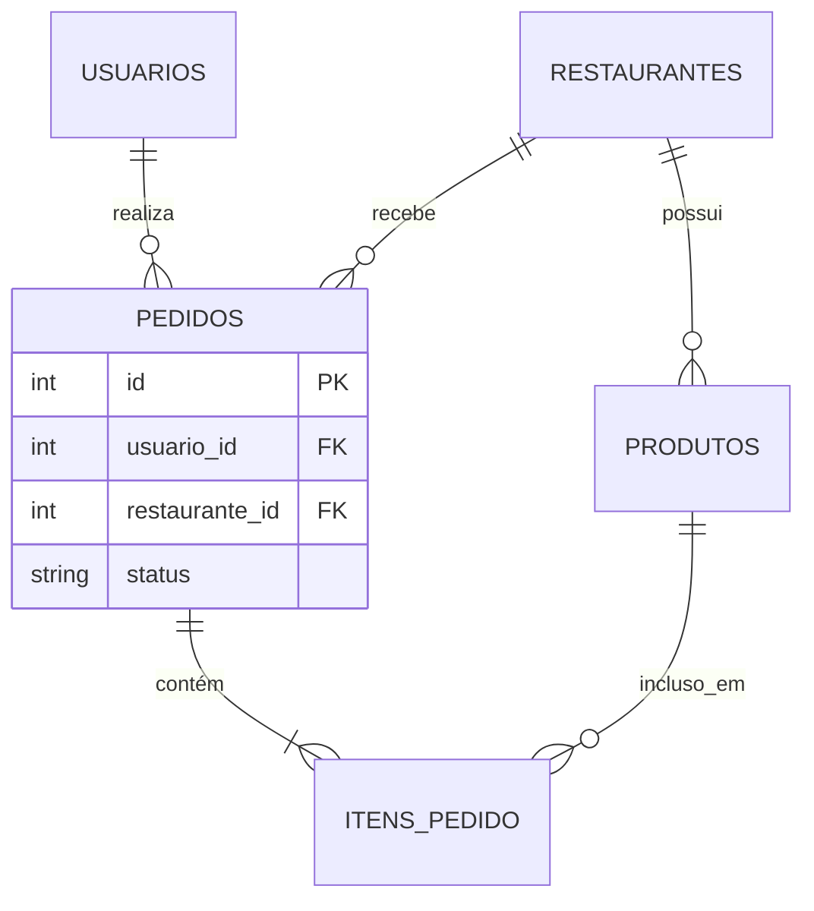

# 🍗 iFrango Premium - Delivery Multi-tenant

**Link da Aplicação em Produção (Protótipo):** [http://ifrango.frangro.com.br](http://ifrango.frangro.com.br)  
**Apresentação do Seminário (Slide Interativo):** Abra o arquivo `Apresentacao_iFrango.html` contido neste repositório no seu navegador.

---

## 👥 Componentes do Grupo
* **Davi Oliveira** - Engenharia de Software / Fullstack

---

## 📄 Documento do Projeto (Padrão ABNT)

### 1. INTRODUÇÃO
O presente documento detalha a engenharia e o desenvolvimento do projeto **iFrango Premium**, um módulo de software voltado para o setor de *food service* e *delivery*. O projeto foi concebido como um Produto Mínimo Viável (MVP) para validar as regras de negócio essenciais de compra, venda e gestão de cardápio em um ambiente *multi-tenant* (múltiplos estabelecimentos na mesma plataforma).

### 2. OBJETIVOS
**2.1 Objetivo Geral:** Desenvolver e homologar um módulo de software web integrado a um banco de dados relacional (PostgreSQL) para gerir o fluxo completo de vendas (checkout) e a administração de cardápios por parte dos fornecedores.

**2.2 Objetivos Específicos:**
* Implementar um sistema de autenticação segregado para Clientes e Gestores.
* Desenvolver um painel administrativo com operações CRUD para a gestão do catálogo.
* Construir um fluxo de carrinho de compras com persistência de dados utilizando chaves estrangeiras (Integridade Referencial).
* Garantir a portabilidade da aplicação através do encapsulamento em contêineres Docker.

### 3. METODOLOGIA E ENGENHARIA DE SOFTWARE
O projeto adotou princípios das metodologias ágeis (Extreme Programming e Scrum). Houve foco no **Desenvolvimento Iterativo** e no **Refactoring Contínuo**, culminando na eliminação de *code-smells* e na transição para uma arquitetura segura e robusta.

### 4. ENGENHARIA DE REQUISITOS

**Requisitos Funcionais (RF):**
* **RF01:** O sistema deve permitir o cadastro e a autenticação com controle de acesso para dois perfis de atores: Clientes (consumidores) e Gestores (administradores de restaurantes).
* **RF02:** O sistema deve garantir o isolamento *multi-tenant*, exibindo o catálogo de produtos filtrado dinamicamente e exclusivamente pelo ID do restaurante acessado.
* **RF03:** O sistema deve prover um carrinho de compras que permita ao Cliente adicionar itens, alterar quantidades, visualizar o subtotal em tempo real e remover produtos.
* **RF04:** O sistema deve registrar o *checkout* gerando uma entidade de Pedido que mantenha a integridade referencial (vínculo exato) entre o Cliente, os Itens escolhidos e o Restaurante.
* **RF05:** O sistema deve disponibilizar um painel administrativo onde o Gestor possa realizar operações completas de CRUD (Criar, Ler, Atualizar, Deletar) sobre o cardápio do seu estabelecimento.
* **RF06:** O sistema deve fornecer uma interface para que o Gestor atualize o status da fila de pedidos (ex: Recebido, Em Preparo, Finalizado) e o Cliente visualize essa mudança.

**Requisitos Não Funcionais (RNF):**
* **RNF01 (Arquitetura e Portabilidade):** A aplicação deve ser conteinerizada e orquestrada utilizando Docker e Docker Compose, garantindo isolamento de ambiente e facilidade de *deploy*.
* **RNF02 (Desempenho e Back-end):** A API RESTful deve ser construída de forma assíncrona utilizando a linguagem Python e o *framework* FastAPI, assegurando alta performance e documentação automática (Swagger/OpenAPI).
* **RNF03 (Persistência e Integridade):** O armazenamento deve utilizar um SGBD Relacional (PostgreSQL), com transações e integridade mapeadas através do ORM SQLAlchemy.
* **RNF04 (Interface e Usabilidade):** O *front-end* deve adotar o padrão SPA (*Single Page Application*), construído com Vanilla JavaScript e estilizado com Tailwind CSS para garantir responsividade em dispositivos móveis.
* **RNF05 (Segurança):** A API deve implementar validações estritas de dados na entrada (via Pydantic) e políticas de CORS configuradas para aceitar apenas requisições da origem oficial do domínio.

---

## 📊 Arquitetura e Diagramas (UML e DFD)

### Diagrama de Contexto (DFD Nível 0)


### Modelo Entidade-Relacionamento (MER)



---

## 💻 Como Rodar o Protótipo Localmente

Certifique-se de ter o Docker e o Docker Compose instalados.

1. Clone o repositório:

```bash
git clone [https://github.com/imthedavi/iFrango.git](https://github.com/imthedavi/iFrango.git)
cd ifrangrofr

```

2. Suba a infraestrutura:

```bash
docker-compose up --build -d

```

3. Acesse: `http://localhost:8000`

* **Parar servidor:** `docker-compose down`
* **Limpar banco (Hard Reset):** `docker-compose down -v`
